<h1 align="center">Hi there, I'm Malik Al Rasyidi 👋</h1>

<h3 align="center">
  A Full Stack Software Engineer dedicated to building scalable, high-performance systems.
</h3>

  I specialize in architecting robust backend logic with <b>Node.js (NestJS/Express)</b>, <b>.NET</b>, and <b>Laravel</b>, 
  bridged seamlessly to dynamic user interfaces using <b>React/Next.js</b> and <b>React Native</b>. 
  I have a strong interest in Clean Architecture, real-time data synchronization (WebSockets), and scalable infrastructure.

---

### 🛠️ Technical Arsenal

My development stack is chosen for performance, modularity, and maintainability across the entire software lifecycle.

#### 📱 Frontend & Mobile Engineering

  
  
  
  
  
  

#### ⚙️ Backend & Business Logic

  
  
  
  
  

#### 🚀 Infrastructure, Data & Real-Time

  
  
  
  
  

---

### 🔭 Featured Engineering Projects

* **[SiKartu Kejati Sumbar](https://github.com/malikrasyid/sikartu)** - A secure administrative data management platform built with React, Node.js, and Express, focusing on data governance and workflow tracking.
* **Nexus Social Engine** - A real-time mobile networking application leveraging **React Native**, **NestJS**, **WebSockets**, and **RabbitMQ** for high-concurrency instant messaging.
* **Sewing Management System** - An enterprise-grade production tracking system architected with **PHP/Laravel** and **MySQL** utilizing strict MVC design patterns.

---

### 📊 GitHub Analytics

  

---

### 🤝 Let's Connect

I am always open to discussing system architecture, full-stack opportunities, or collaborating on impactful projects. 

| Connect | Link |
| :--- | :--- |
| 💼 **LinkedIn** | [My LinkedIn Profile](https://www.linkedin.com/in/malikalrasyidi/) |
| 🌐 **Portfolio** | [My Web Portfolio](https://malik-dev-porto.vercel.app/) |
| 📧 **Email** | [malikalrasyidi001@gmail.com](mailto:malikalrasyidi001@gmail.com) |
